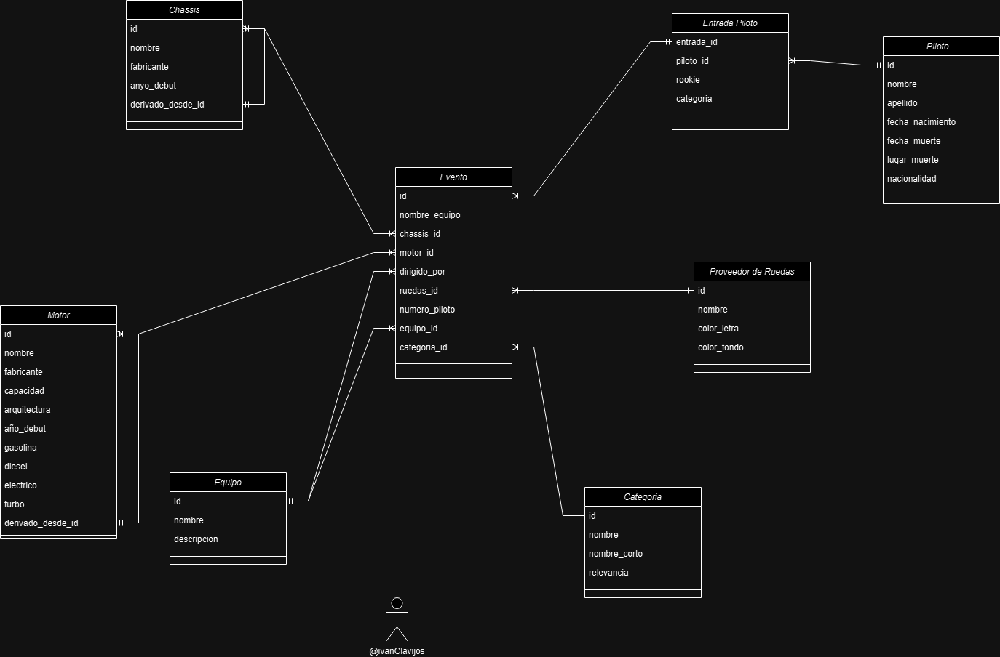

# MOTORSPORT DATABASE

Este proyecto es una base de datos para deportes de motor, en la cual se pueden encontrar datos de pilotos, escuderías, circuitos, carreras, y más. La base de datos está compuesta por 8 tablas:

- **pilotos**
- **categoria**
- **chassis**
- **equipo**
- **ruedas**
- **entradaPiloto**
- **evento**
- **motor**

***
### Instrucciones para la importacion de la bd
La bd esta creada con Postgres v 16.4 asi que se debera de instalar esa version para asegurarse de que la bd se importa bien.
En postgres se debe crear un usuario llamado 'msdb_user' para la importacion de la bd.
Se adjuntara un archivo msdb.backup con la bd para que se pueda importar a postgres yo la he importado directamente desde el software.

***

## Diagrama Entidad-Relación

---

## Tablas

### Piloto
- **idPiloto**: Identificador del piloto
- **nombre**: Nombre del piloto
- **apellido**: Apellido del piloto
- **fechaNacimiento**: Fecha de nacimiento del piloto
- **nacionalidad**: Nacionalidad del piloto
- **fecha_muerte**: Fecha de muerte del piloto (si aplica)
- **lugar_muerte**: Lugar de muerte del piloto (si aplica)

### Categoria
- **id**: Identificador de la categoría
- **nombre**: Nombre de la categoría
- **nombre_corto**: Nombre corto de la categoría
- **relevancia**: Relevancia de la categoría

### Chassis
- **id**: Identificador del chasis
- **nombre**: Nombre del chasis
- **fabricante**: Fabricante del chasis
- **año_debut**: Año de debut del chasis
- **derivado_de**: Chasis del que deriva (si aplica)

### Equipo
- **id**: Identificador del equipo
- **nombre**: Nombre del equipo
- **descripcion**: Descripción del equipo

### Ruedas
- **id**: Identificador de las ruedas
- **nombre**: Nombre del fabricante de las ruedas
- **color_letra**: Color de la letra en las ruedas
- **color_fondo**: Color de fondo en las ruedas

### EntradaPiloto
- **id**: Identificador de la entrada del piloto
- **idPiloto**: Identificador del piloto
- **rookie**: Indica si el piloto es novato (rookie) o no
- **categoria**: Categoría en la que compite

### Motor
- **id**: Identificador del motor
- **nombre**: Nombre del motor
- **fabricante**: Fabricante del motor
- **capacidad**: Capacidad del motor
- **arquitectura**: Arquitectura del motor
- **año_debut**: Año de debut del motor
- **gasolina**: Indica si es un motor a gasolina
- **turbo**: Indica si es un motor turbo
- **diesel**: Indica si es un motor diésel
- **electrico**: Indica si es un motor eléctrico
- **derivado_de**: Motor del que deriva (si aplica)

### Evento
- **id**: Identificador del evento
- **nombre_equipo**: Nombre del equipo
- **chassis_id**: Identificador del chasis
- **ruedas_id**: Identificador de las ruedas
- **motor_id**: Identificador del motor
- **piloto_id**: Identificador del piloto
- **categoria_id**: Identificador de la categoría
- **dirigido_por**: Equipo padre (si aplica)
- **equipo_id**: Identificador del equipo del evento
- **numero_pilotos**: Número del piloto en el evento

---

## Explicación de Relaciones
- Un piloto puede tener varias entradas en diferentes categorías.
- Un evento tiene un equipo, un piloto, un motor, un chasis y unas ruedas.
- Un equipo puede participar en varios eventos.
- Un motor puede derivar de otro motor.
- Un chasis puede derivar de otro chasis.
- Un evento puede tener varios pilotos.
- Un evento puede tener varios equipos.
- Un evento puede tener varios motores.
- Un evento puede tener varios chasis.
- Un evento puede tener varias ruedas.
- Un evento no puede tener más de un piloto con el mismo número.

***

## Tecnologías usadas

### Gestión de Base de Datos

Usé **PostgreSQL** como gestor de base de datos porque es común en el sector privado y la base de datos que utilicé estaba ya configurada para trabajar con PostgreSQL y pgAdmin.

### Lenguaje de Programación

### Librerías usadas
- **Lombok**: Esta librería ayuda a reducir la cantidad de código y hacer el código más limpio, facilitando la generación automática de getters, setters, y otros métodos comunes.
- **Log4j**: Esta librería se utiliza para hacer logs en la aplicación.
- **JDBC**: Esta librería se utiliza para conectarse a la base de datos y hacer consultas.

## Agradecimientos
Muchas gracias a [Ivan Clavijos](https://x.com/iclavijos) el creador y autor de la página [Motorsport Database](https://www.motorsports-database.racing/) y el cual me ha dado la BD para poder hacer este proyecto, esto me servira para futuros proyectos y para aprender mas sobre el mundo del motorsport.